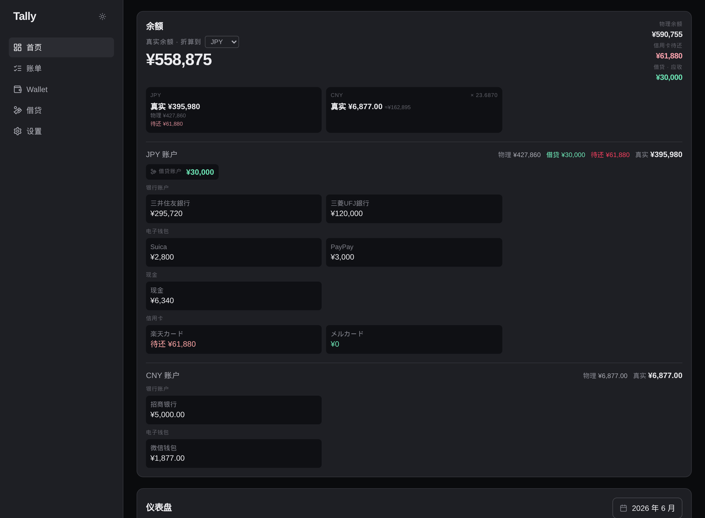
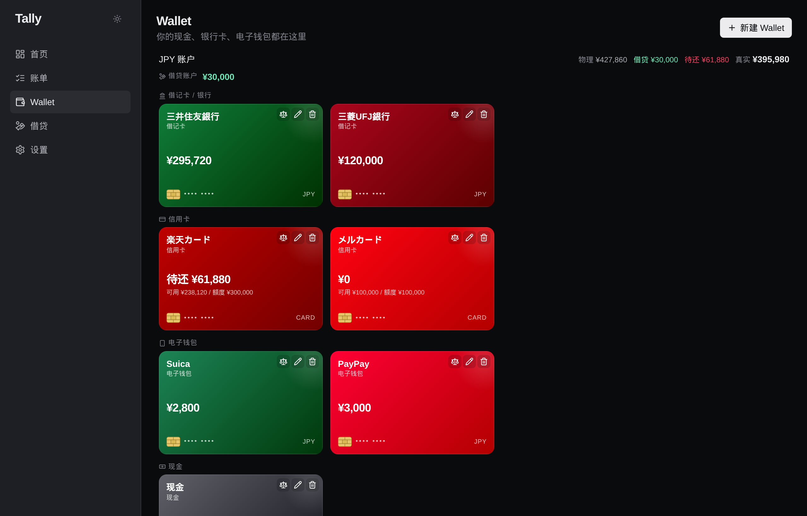
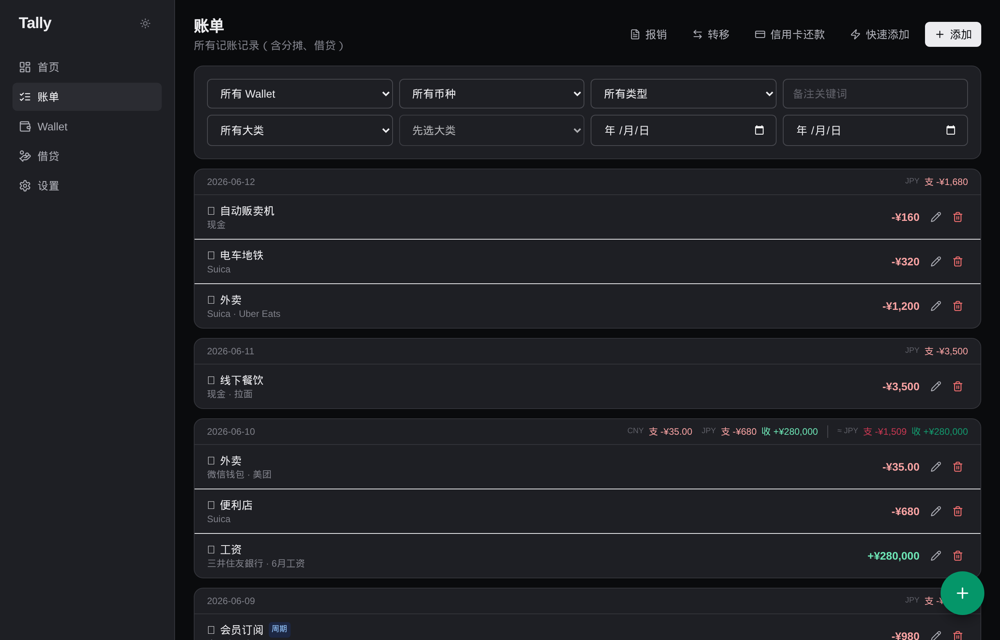

# Tally

Self-hosted, multi-currency personal finance tracker — built for someone juggling **JPY and CNY** day to day. Everything (data + app) lives in a single Docker container on your own machine; nothing leaves your server.



## Features

- **Multi-currency, one net worth** — every wallet keeps its own currency; totals fold to your chosen base currency at the current FX rate (auto-fetched from frankfurter.app).
- **Two balance lenses** — *真实余额 (real)* = everything you own incl. money lent out; *物理余额 (physical)* = cash actually in hand. Lending is split out into a per-currency **借贷账户 (loan account)**, so each wallet card just shows its real balance.
- **Real bank-card wallets** — grouped by type (bank / credit card / e-wallet / cash), shown at true card proportions. Credit cards track a **credit limit** and show remaining available = limit − outstanding.
- **Fast bill entry** — two-level categories, merchant autocomplete (CN/JP/EN aliases), on-screen number pad, receipt attachments, and AA split with contacts.
- **Recurring bills** — forecast of the next ±7 days; one click to confirm a charge (prefilled from the template), which rolls the prediction forward.
- **Transfers & FX, credit-card repayment, reimbursements, reconciliation** (with cash denomination counting).
- **Loans** — per-contact receivable/payable accounts, repayments, bad-debt write-off.
- **Stats** — month KPIs, top merchants & categories, spending-pace comparison across months.
- **Import / export**, dark mode (default), installable PWA, mobile-friendly.

| Wallets | Bills |
|---|---|
|  |  |

## Run

Prerequisites: **Docker** + **Docker Compose**.

```bash
# 1. clone
git clone https://github.com/HoshiyomiLusia/Tally.git
cd Tally

# 2. configure
cp .env.example .env
#    edit .env — at minimum set a long random SECRET_KEY.
#    APP_PORT defaults to 8088; change it if that port is taken.

# 3. build & start (first run builds the image, ~a few minutes)
docker compose up -d --build
```

Then open **http://localhost:8088** and register an account (the first run seeds default categories & merchants for you). Database migrations run automatically on startup.

Your data lives in `./data/` (bind-mounted): `tally.db` plus uploaded receipts under `data/receipts/<user_id>/`. Nothing is committed to git.

### Updating

```bash
git pull
docker compose up -d --build   # rebuilds and restarts; migrations auto-apply
```

### Backups

`./data/tally.db` is a plain SQLite file — copy it (and `data/receipts/`) to back up. To restore, stop the container, replace the files, start again.

## Stack

FastAPI + SQLAlchemy (async) + Alembic + SQLite on the backend; React + Vite + TypeScript + Tailwind + TanStack Query on the frontend. The frontend is built and served by the backend from one container.

## License

MIT
